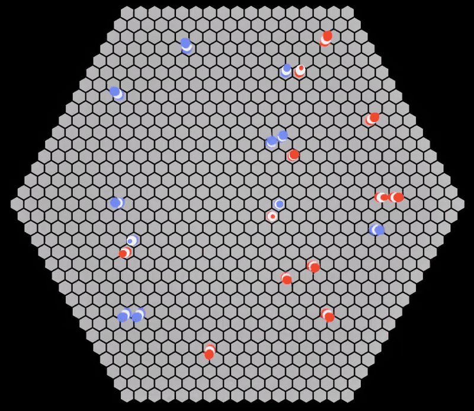
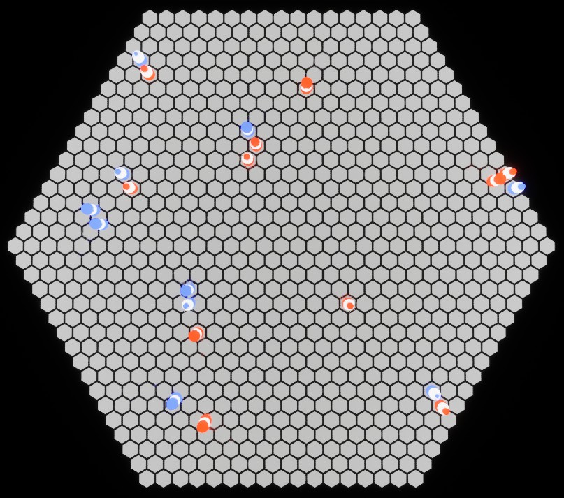
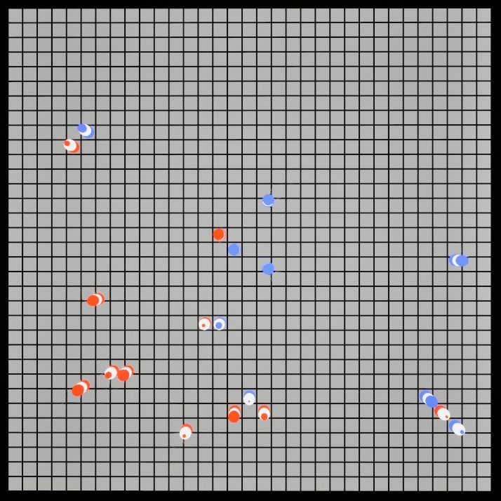

# George McDonagh | Illuvium Gameplay Engineer Task



## Quick Start Guide

1. Download the contents of the **[/UE](./UE/)** folder in this repository.
2. Open UE/IlluviumTest.uproject in Unreal Engine 5. The project was created with **Unreal Engine 5.5.4**, so use this version for best result or if you're having trouble loading or building the project.
3. The project should open in the **Content/Maps/Arena.umap** Map by default. If it doesn't, then open it.
4. Hit the Play-In-Editor button to run the game. **You can fly around to get a better look at the map**.
5. **Play around with the simulation settings**. These can be found in **`Content/BP_ArenaGameMode > Class Defaults > Details panel > Arena Game Mode Base`**. Hover over each property to see a more detailed description.

## Overview

This project is split in to three parts, architecturally speaking: the simulation logic, the visualisation layer, and the Game Mode which acts as a bridge between the two.
The logic can be found in [BattleSimulator.h/.cpp](./UE/Source/IlluviumTest/Private/BattleSimulator.h) and [Pathfinding.h/.cpp](./UE/Source/IlluviumTest/Private/Pathfinding.h). The visualisation
layer is comprised of the various Blueprints in the Content folder, mainly `BP_ArenaGameMode` and `BP_ArenaBattleUnit`, which deal with Actor spawning and movement, respectively.
Finally, [ArenaGameModeBase.h/.cpp](./UE/Source/IlluviumTest/Private/ArenaGameModeBase.h) is a lightweight Game Mode which exposes some of the simulation's state to Blueprints.

The visualisation component of this solution could be improved. I purposefully chose an unlit, stripped-back aesthetic to put a focus on the simulation functionality but frankly, after spending the full eight hours or so
on this task all-in-all (including documentation) I ran out of time to add nicer visuals for taking/dealing damage and dying.
What is currently in place is some fairly rudemanary location lerping for the movement, and a token attached to each Unit which represents the Unit's remaining hit points.

Given the nature of this project I have been quite verbose with my code comments - perhaps more verbose than I usually might be - in the hopes of making my intentions crystal clear.
Having said that, I will say a few words regarding my philosophy for this solution to the problem:

I wanted to make sure that as I worked on the solution to the task it didn't fall in to some rigid architecture that resisted changes. I set out to complete the initial criteria of the task as well as the *extra credit*
tasks later on, and so I wanted to keep the code extensible. This was facilitaded in a couple of ways.

### Flexible Configuration

The first was to design the simulation around the idea that we might have any number of teams with any number of units.
In theory the simulation will function just fine with a single team with a single Unit, and several teams each with many Units. As it stands, the simulation is hard-coded to involve two teams, but with very few changes we can
enable the simulation to support a variable number of teams:

```C++
// BattleSimulation.cpp:

// Currently, with fixed teams:
void FBattleSimulator::Reset()
{
    ...

    TeamStates = TMap<EBattleTeamLabel, FBattleSimulationTeamState>({
		    {EBattleTeamLabel::Blue, {}},
		    {EBattleTeamLabel::Red, {}}
    });

    ...
}

// To support any number of teams:
void FBattleSimulator::Reset()
{
    ...

    Teams = TArray<EBattleTeamLabel> {
        EBattleTeamLabel::Blue,
        EBattleTeamLabel::Red,
        EBattleTeamLabel::Green,
        EBattleTeamLabel::Yellow,
        ...
    }

    for (auto TeamLabel : Teams)
        TeamStates.Add(TeamLabel, {});

    // and the rest of the initialisation logic remains the same...
    ... 
}
```

### Flexible Pathfinding

Secondly, I wanted to make sure that in the end we would be able to choose between an orthogonal and a hexagonal map, rather than replace the first with the latter. One big thing to consider here is how the pathfinding algorithm works.
If we're not careful, then we might design our pathfinding around any one particular map layout. For example we might check neighbouring tiles via some relative coordinates. However, this solution would not work for both orthogonal and
hexagonal coordinates, as they exist in fundamentally different space. The solution is to take away from the pathfinding algorithm the burden of finding neighbouring connections, and instead create those connections when we generate the map,
and cache them in a list that the pathfinding algorithm can simply search.

Since we now support multiple map types with different underlying coordinate systems, it's important that we offer the visualization layer a way of converting either coordinate system to world-space. This is done via a single function that's
made available to the visualisation logic:

```C++
FVector3f AArenaGameModeBase::TileCoordinatesToWorldCoordinates(const FVector3f& TileCoordinates) const
{
    if (BattleSimulationConfig.bHexMap)
    {
        constexpr float HalfSizeScale = 0.65f;
        return {
            sqrtf(3.0f) * HalfSizeScale * (TileCoordinates.Z / 2 + TileCoordinates.X),
            1.5f * HalfSizeScale * TileCoordinates.Z,
            0
        };
    }

    return TileCoordinates;
}
```

This way the simulation and pathfinding logic can work with either the orthogonal or cube coordinates, and the visualisation layer can query the Game Mode for the correct world-space coordinates when drawing the Actors.



## In Summary

I strived for a forward-thinking, flexible philosophy in working on this task. While I think that these are valuable virtues to hold as a programmer, I do not necessarily think that this is the absolute best philosophy to keep on such tasks.
In the real world working as a gameplay engineer one would usually have some line of communication with stakeholders, designers, or clients. Usually, it's wise to invest in frequent catch-ups and back-and-forths while working to fulfil some feature request. In contrast to this occasion,
this often results in some focus or narrowing of a given implementation design.
